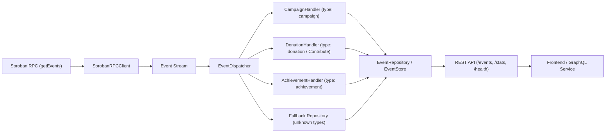

# Indexer Service: Data Model, Sync Guarantees & Operations Runbook

The **Indexer Service** (`services/indexer`) is an off-chain ingestion daemon for Fund-My-Cause. It streams and normalises smart contract events from Stellar/Soroban RPC into a queryable, memory-indexed store, decoupling client queries from RPC rate limits and enabling high-performance relational access.

---

## 1. Architecture & Overview

The indexer acts as a read-only derived projection of on-chain contract state.



### Core Components

- **`SorobanRPCClient`** (`src/rpc-client.ts`): Polls Soroban RPC using `getEvents` with circuit-breaker protection and automatic reconnection.
- **`EventDispatcher`** (`src/handlers/dispatcher.ts`): Routes batches of parsed events to domain handlers based on event type and registered aliases.
- **Domain Handlers** (`src/handlers/`):
  - `CampaignHandler`: Ingests campaign creation, metadata updates, deadlines, and goals.
  - `DonationHandler`: Ingests contribution events, pledges, and running totals (handles legacy `Contribute` alias).
  - `AchievementHandler`: Ingests contributor badges, tiers, and gamification rewards.
- **`EventStore` / `EventRepository`** (`src/event-store.ts`, `src/repository.ts`): Storage engine maintaining primary event storage and O(1) secondary indexes (`contractIndex` and `typeIndex`).
- **HTTP Server** (`src/index.ts`): Express server exposing `/events`, `/stats`, `/health`, `/healthz`, and `/readyz`.

---

## 2. Ingested Event Types & Data Model

### Canonical Event Model (`IndexerEvent`)

All raw contract events are transformed into a uniform schema before storage:

| Field | Type | Description |
|---|---|---|
| `id` | `string` | Unique event ID formed as `{ledgerSeq}-{txIndex}-{eventIndex}` |
| `timestamp` | `number` | **UTC milliseconds** since Unix epoch (`Date.now()` format) |
| `type` | `string` | Normalized domain type (`campaign`, `donation`, `achievement`, etc.) |
| `contractId` | `string` | Stellar StrKey encoded contract address (`C...`) |
| `data` | `Record<string, unknown>` | Normalized payload fields |

### Domain Event Payloads

#### 1. `campaign`
Emitted upon campaign initialization or metadata modifications.
```json
{
  "creator": "GBABC...",
  "title": "Clean Water Initiative",
  "goal": "100000000000",
  "deadline": "1735689600",
  "token": "CDLZ...",
  "min_contribution": "10000000"
}
```

#### 2. `donation` (Alias: `Contribute`)
Emitted on contributor pledges.
```json
{
  "contributor": "GCONTRIB...",
  "amount": "500000000",
  "total_raised": "1500000000",
  "matched_amount": "0"
}
```

#### 3. `achievement`
Emitted when gamification thresholds or donor milestones are attained.
```json
{
  "contributor": "GCONTRIB...",
  "achievement_type": "first_contribution",
  "badge": "early_supporter",
  "points": 100
}
```

---

## 3. Storage & Index Projections

The indexer repository isolates query access through distinct repository interfaces:

- **`EventRepository`**: Generic queries by contract, type, or recent event stream.
- **`CampaignRepository`**: Campaign-scoped event streams.
- **`ContributionRepository`**: Targeted query for contribution events.

### Secondary Indexes
`EventStore` maintains two secondary index sets:
1. `contractIndex: Map<contractId, Set<eventId>>`
2. `typeIndex: Map<eventType, Set<eventId>>`

Compound queries (e.g. `queryByContractAndType`) intersect these sets to deliver sub-millisecond lookups without full dataset scans.

---

## 4. Reorg Handling & Sync Guarantees

### Stellar Consensus Protocol (SCP) Finality
Unlike proof-of-work blockchains, Stellar employs federated Byzantine agreement. Once a ledger closes:
- Finality is **deterministic and immediate** (no probabilistic block reorganizations or 1-conf rollbacks under standard network operation).
- Eventual consistency lag is bounded by the ledger close time (**~5 seconds**).

### Idempotency & Duplicate Protection
- Ingestion is strictly idempotent: every event is indexed by its deterministic `id` (`{ledgerSeq}-{txIndex}-{eventIndex}`).
- Re-ingesting previously processed events is a safe, non-destructive operation.

### Memory & Capacity Boundaries
- `EventStore` enforces capacity limits configured via `StoreConfig` (defaulting to 10,000 events or `INDEXER_MAX_CAPACITY`).
- When capacity is reached, LRU eviction discards the oldest entries while maintaining secondary index integrity.

---

## 5. Operations Runbook: Resync & Recovery

### Health & Readiness Probes

| Endpoint | Method | Purpose | Healthy Response |
|---|---|---|---|
| `/health` / `/healthz` | `GET` | Process liveness | `200 OK` `{"status": "healthy"}` |
| `/readyz` | `GET` | RPC connection & streaming check | `200 OK` `{"ready": true}` |
| `/stats` | `GET` | Ingestion metrics & circuit breaker stats | `200 OK` |

### Full Resync Procedure

If the indexer cache falls out of sync or needs a full rebuild:

1. **Stop the indexer daemon**:
   ```bash
   # Systemd / Docker
   docker stop fund-my-cause-indexer
   ```

2. **Configure Start Ledger (Optional)**:
   Set `START_LEDGER` in environment or `.env` if replaying from a specific block height:
   ```bash
   export START_LEDGER=12345678
   ```

3. **Restart the Service**:
   ```bash
   docker start fund-my-cause-indexer
   ```

4. **Verify Re-sync Status**:
   Check that event count increases and health status reports healthy:
   ```bash
   curl http://localhost:3001/stats
   curl http://localhost:3001/readyz
   ```

5. **Verify Secondary Index Consistency**:
   Internal verification runs automatically via migrations; check service logs for:
   `"Secondary indexes enabled"` and `"Streaming events from Soroban RPC"`.
